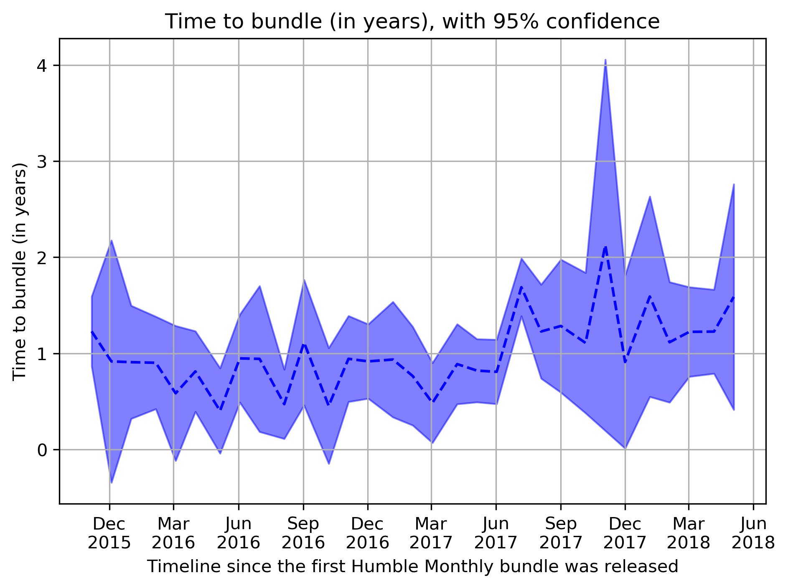

# Humble Monthly Bundles

This repository contains code to analyze the content of past Humble Monthly Bundles.

## Data ##

Data is included along the code in this repository, as downloaded on March 3, 2018.

In case you want to tinker with part of the pre-processed data, [a snapshot](https://gist.githubusercontent.com/woctezuma/e9355ea0dfa30746ccf101b2053c064a/raw/c7f990eda6e9dd74deaa42869e6f29d08ace7efc/humble_monthly_data.txt) is made available. This includes every release date.

## Usage ##

Install Python 3 and the project [`requirements`](requirements.txt). Run [`plot_time_series.py`](plot_time_series.py).

## Plots ##

Plots can be found in the following folders:
 * [`plots/`](plots/) with every Humble Monthly Bundle, including the last one which is only partially revealed (Early Unlocks),
 * [`plots_fully_revealed_bundles/`](plots_fully_revealed_bundles/) with a constraint to fully-revealed Humble Monthly Bundles.  

An example is shown below, with the time to bundle, i.e. the time between a game release and its appearance in a Humble Monthly bundle. This time can be negative for a game which is released on Steam after it appeared in a Humble Monthly bundle. Please note that only games for which Steam keys are provided for no additional cost to Humble Monthly subscribers are taken into account. 

