# Plots of fully-revealed bundles

In contrast to [`plots/`](../plots/), this folder only features fully-revealed bundles, which means the last bundle in the timeserie is ignored if only the Early Unlocks are revealed.

**Caveat**: whenever a plot shows shaded areas, the data is averaged for each Humble Monthly bundle, and the plot shows the mean (dotted line) and the 95%-confidence interval (shaded area). For instance, the plot with respect to `price` does not show the total price (the sum of Manufacturer's Suggested Retail Prices) but the average price of the Steam games included in each Humble Monthly Bundle.   

## Features based on Wikipedia

The following feature is computed with [Wikipedia](https://en.wikipedia.org/wiki/List_of_Humble_Bundles#Humble_Monthly_Bundles):

* number of Steam games - number of games which have a Steam store page, among these included in a Humble Monthly bundle

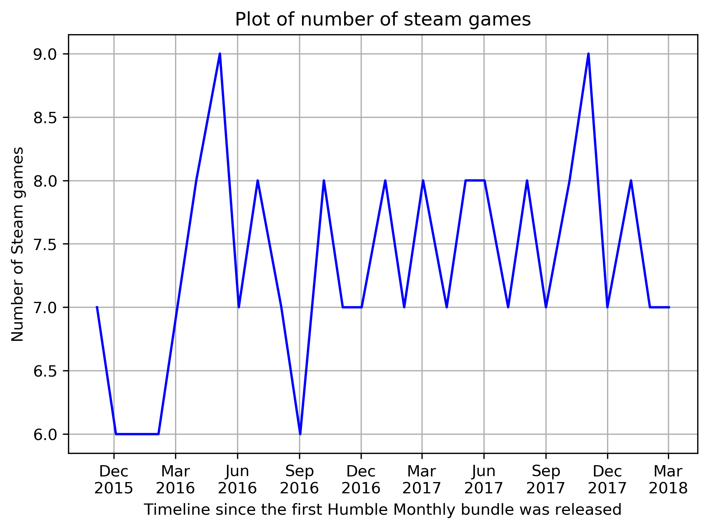

## Features based on Steam API

The following feature is computed with i) the game release date provided by Steam API, ii) the bundle release date on the first Friday of each month:

* time to bundle (in years) - time between a game release and its appearance in a Humble Monthly bundle **It can be negative!** 

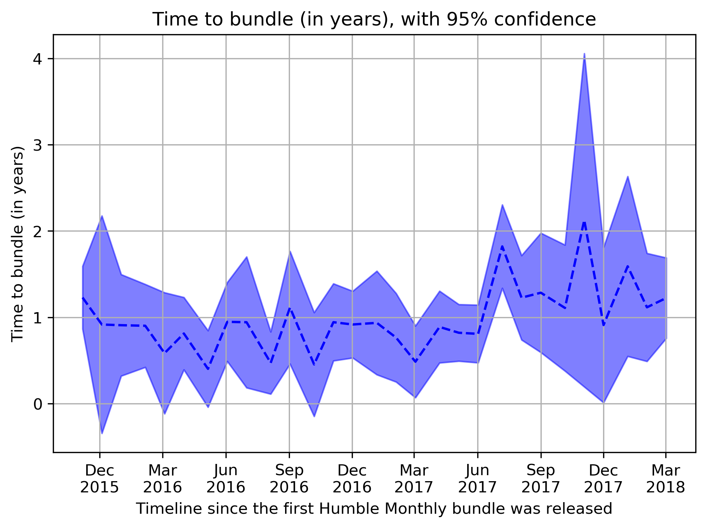

## Features based on SteamSpy API 

The following features are available with [SteamSpy API](https://steamspy.com/api.php):

  * score_rank - score rank of the game based on user reviews

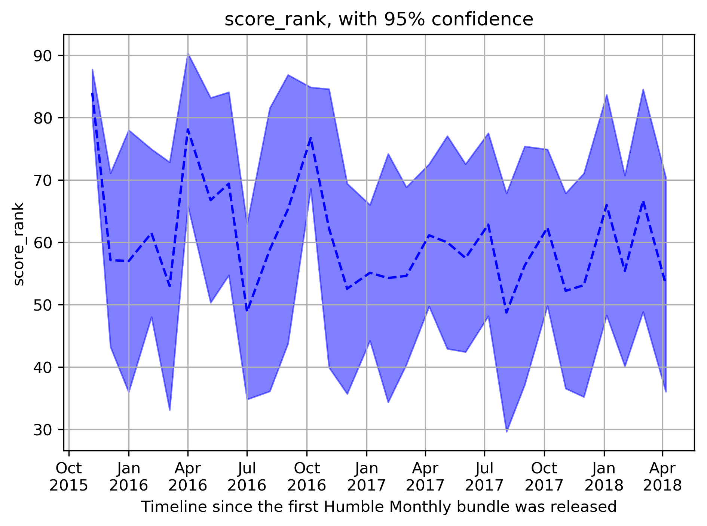

  * positive - number of positive user reviews

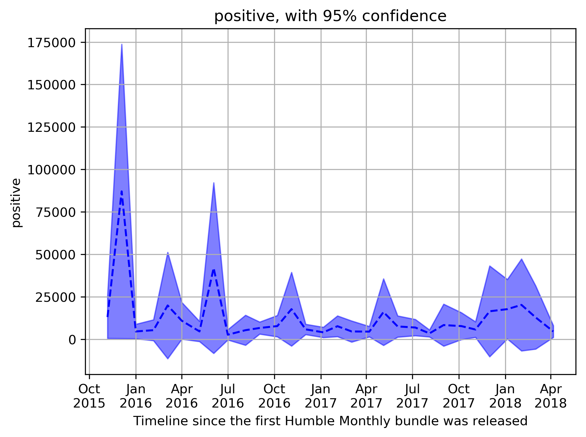

  * negative - number of negative user reviews
  
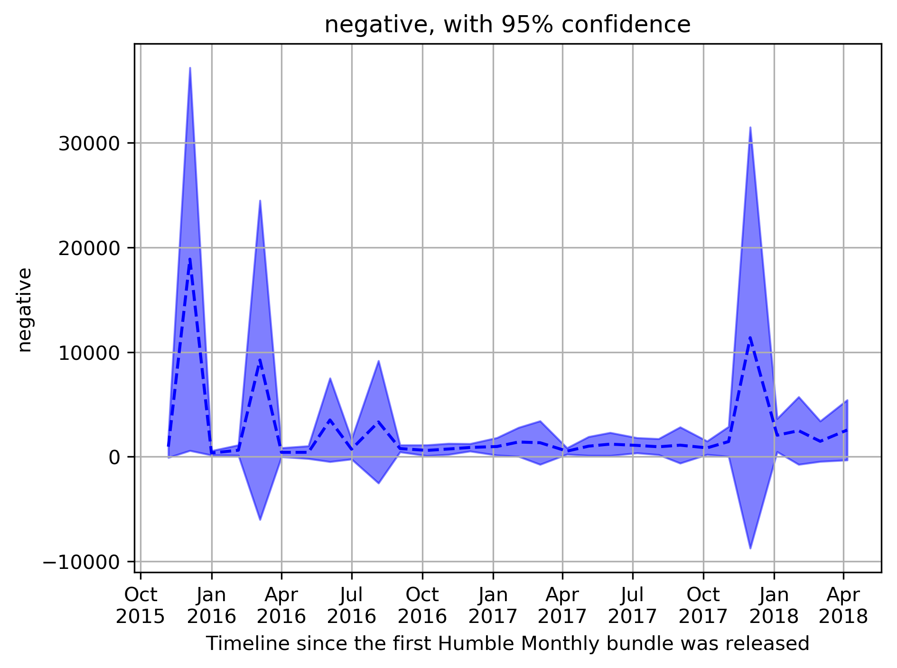
  
  * userscore - user score of the game
  
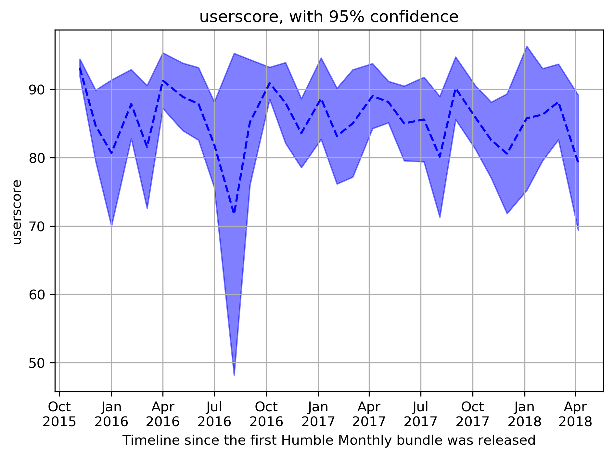  
  
  * owners - owners of this application on Steam. **Beware of free weekends!**

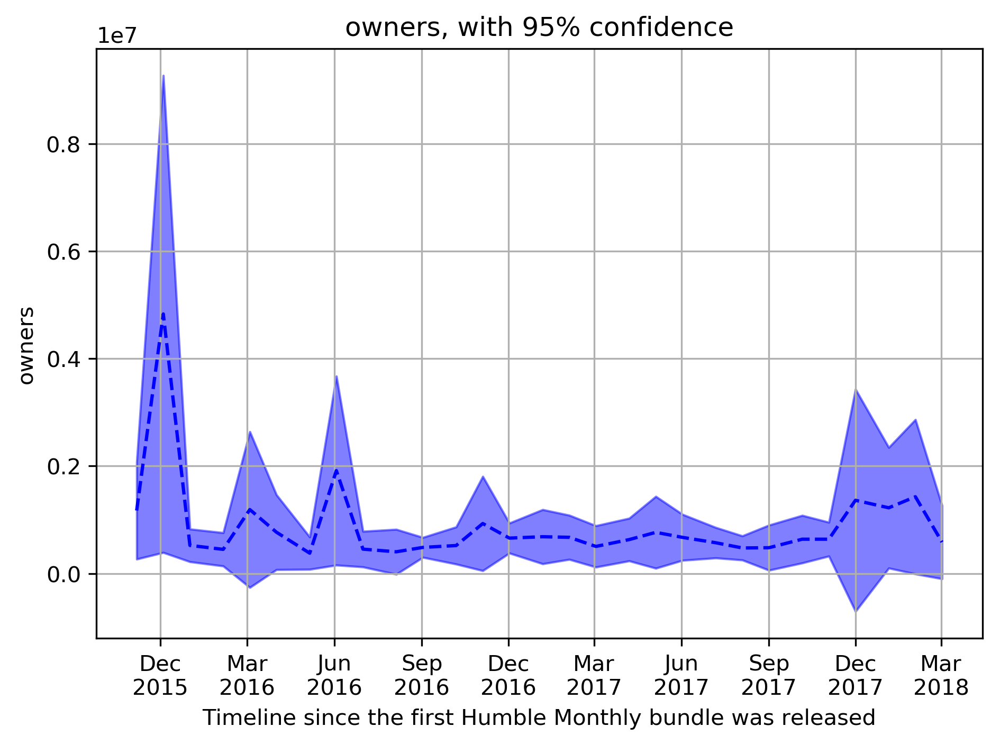

  * players_forever - people that have played this game since March 2009.

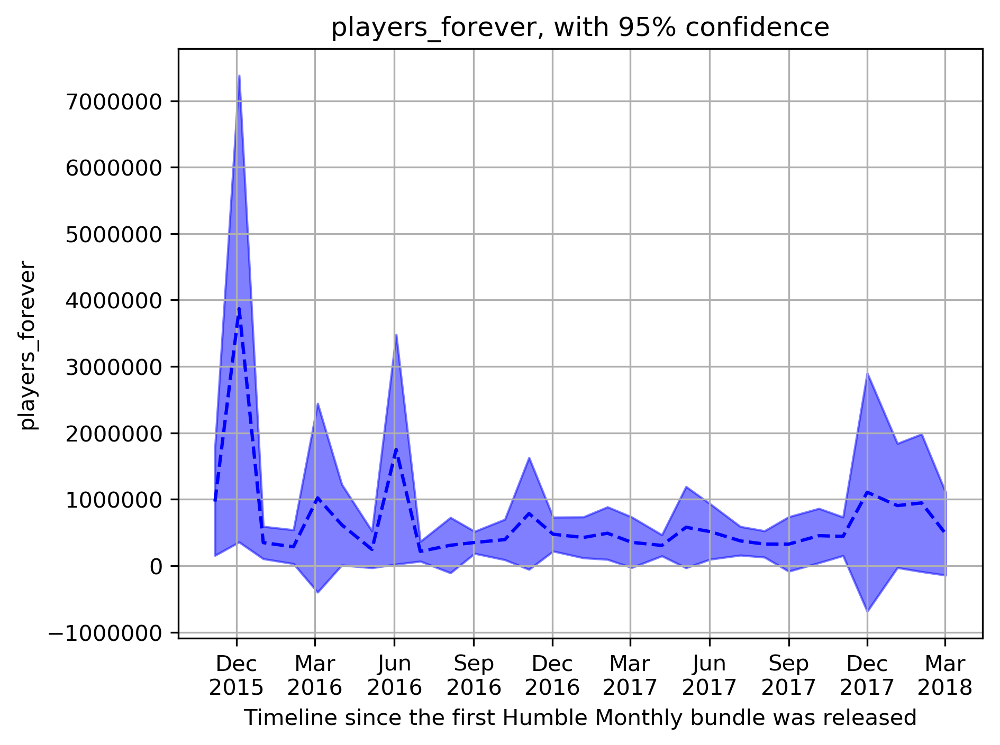

  * average_forever - average playtime since March 2009. In minutes.

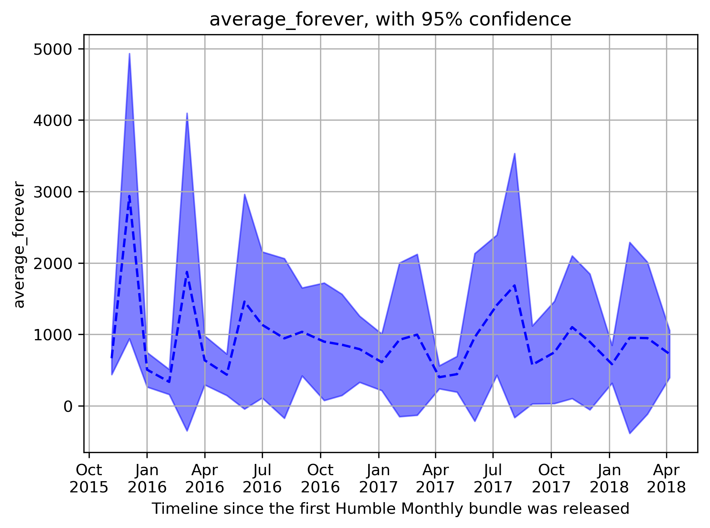

  * median_forever - median playtime since March 2009. In minutes.
  
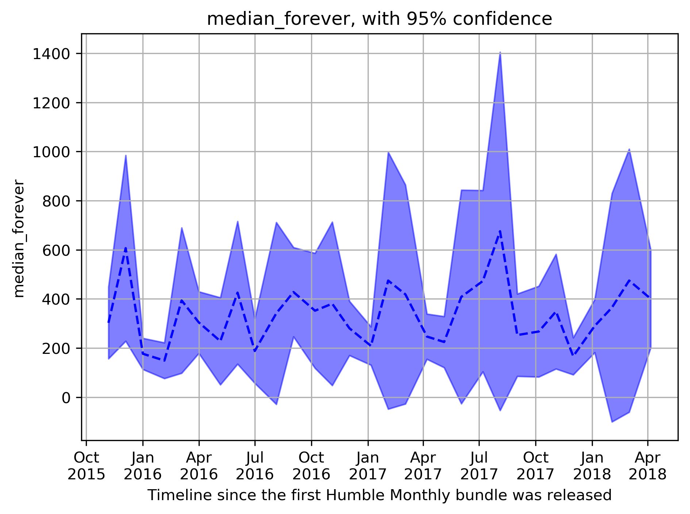  
  
  * price - US price in cents.

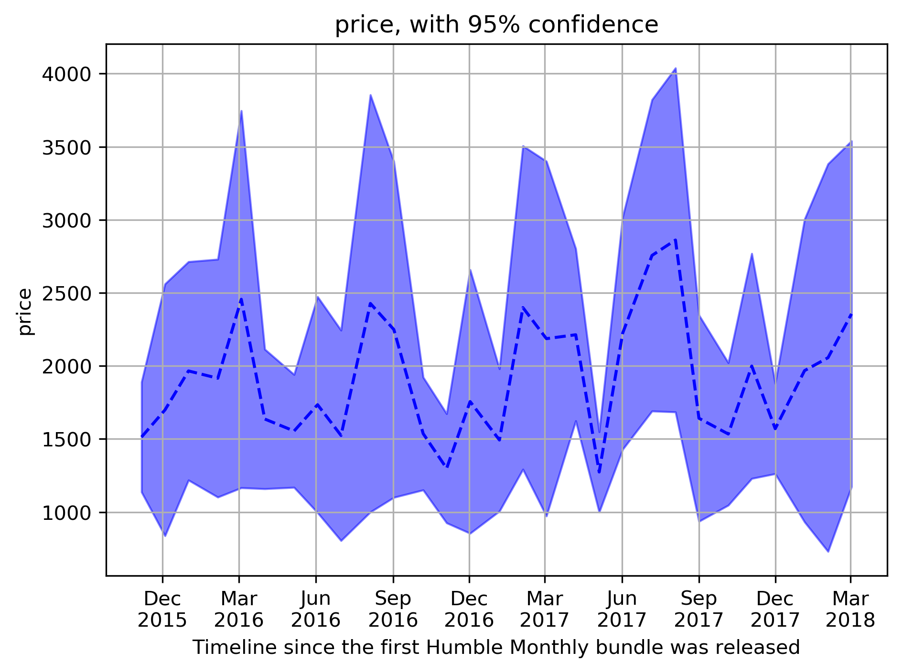

The following feature is computed:

  * number of reviews - sum of `positive` and `negative`

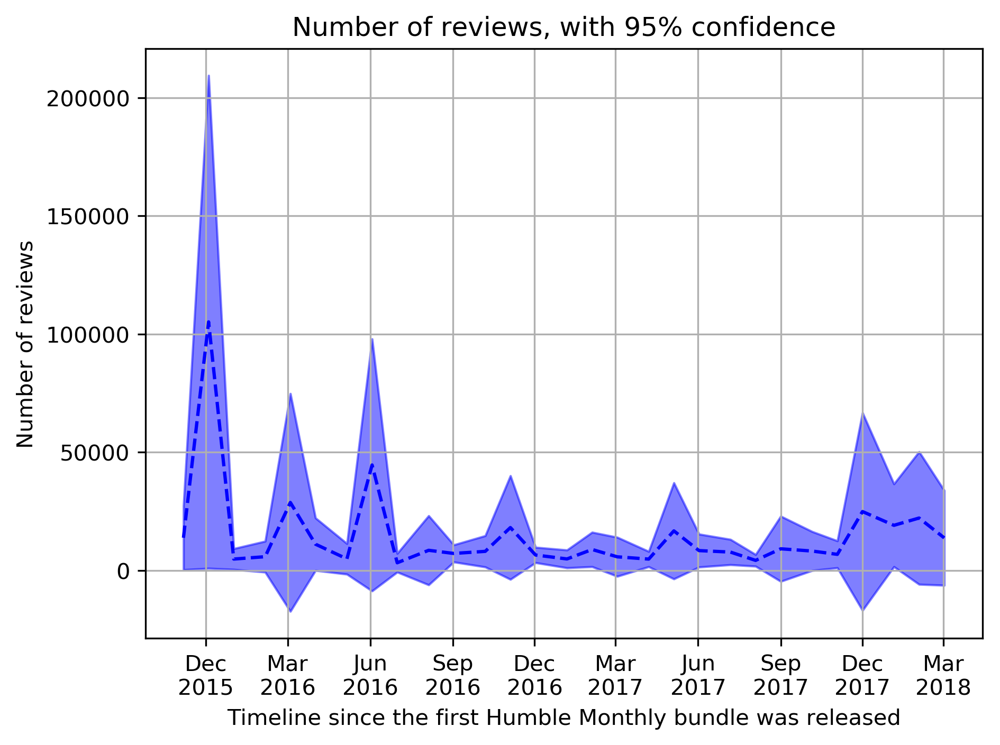
